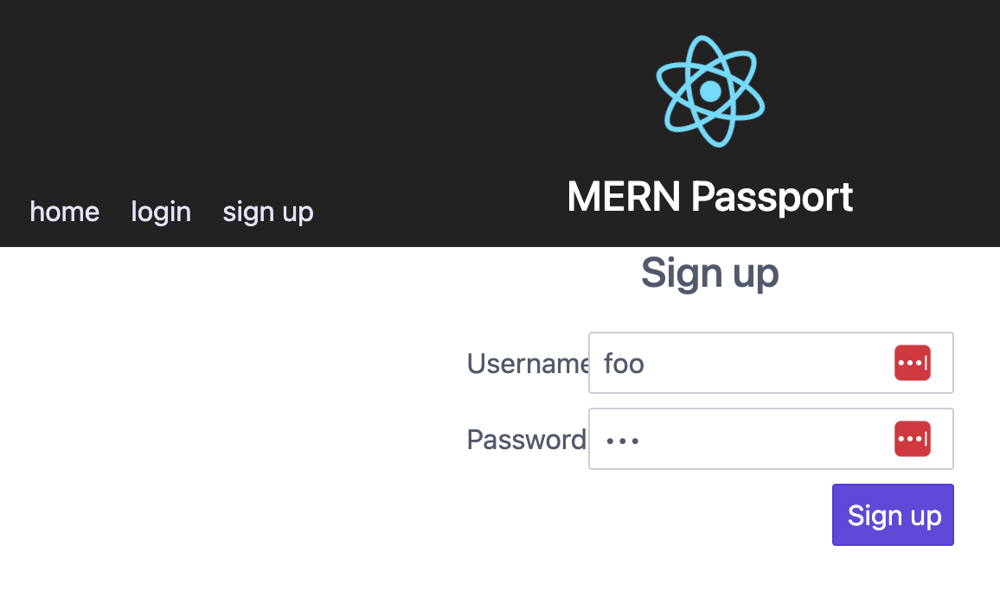
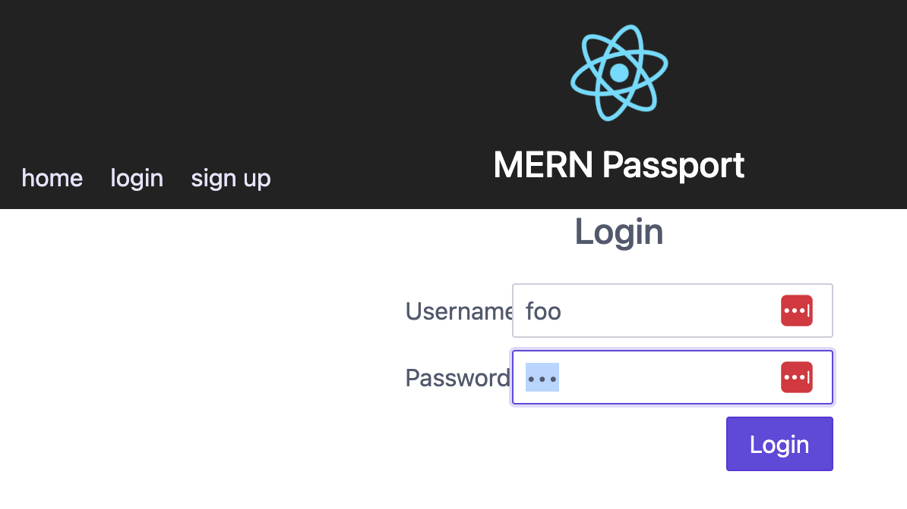

# Passport
This tutorial will show you how to set up authentication using passwords with passport.

1. First download the git repository with git clone.  Notice that it has a front-end and a back-end directory.  Open two windows, in one enter:
```
cd front-end
npm install
npm start

```
In the other window
```
cd back-end
npm install
node server.js
```

2. Now test the application by going to ```http://yourserver:8080``` in your browser.  You should see the home view


When you select the signup menu, you should be able to create a password.



When you select the login menu, you should be able to see the home view with a personalized greeting.




3. Lets look at the pieces of the application and how they work together. ```src/App.js``` creates routes for home, login and signup and inserts a greeting if the user is authenticated.
```js
import React, { Component } from 'react';
import axios from 'axios'
import {Routes, Route} from 'react-router-dom'
// components
import Signup from './components/sign-up'
import LoginForm from './components/login-form'
import Navbar from './components/navbar'
import Home from './components/home'

class App extends Component {
  constructor() {
    super()
    this.state = {
      loggedIn: false,
      username: null
    }

    this.getUser = this.getUser.bind(this)
    this.componentDidMount = this.componentDidMount.bind(this)
    this.updateUser = this.updateUser.bind(this)
  }

  componentDidMount() {
    this.getUser()
  }

  updateUser (userObject) {
    this.setState(userObject)
  }

  getUser() {
    axios.get('/user/').then(response => {
      console.log('Get user response: ')
      console.log(response.data)
      if (response.data.user) {
        console.log('Get User: There is a user saved in the server session: ')

        this.setState({
          loggedIn: true,
          username: response.data.user.username
        })
      } else {
        console.log('Get user: no user');
        this.setState({
          loggedIn: false,
          username: null
        })
      }
    })
  }

  render() {
    return (
      <div className="App">
   
        <Navbar updateUser={this.updateUser} loggedIn={this.state.loggedIn} />
        {/* greet user if logged in: */}
        {this.state.loggedIn &&
          <p>Join the party, {this.state.username}!</p>
        }
        {/* Routes to different components */}
        
        <Routes>
        <Route
          exact path="/"
          element={<Home/>} />
        <Route
          path="/login"
          element={<LoginForm
              updateUser={this.updateUser}
            />}
        />
        <Route
          path="/signup"
          element={<Signup/>}
        />
        </Routes>
        
        

      </div>
    );
  }
}

export default App;

```


4. Look at ```src/components/home.js``` The home.js component just displays a simple message.  If we are authenticated, then App.js will display our username.
```js
import React, { Component } from 'react'

class Home extends Component {
    constructor() {
        super()
    }

    render() {
        return (
            <div>
                <p>It's good to be home</p>
            </div>
        )

    }
}
export default Home
```

5. ```src/components/login-form.js``` creates a form and calles the login route.
```js
import React, { Component } from 'react'
import { Navigate } from 'react-router-dom'
import axios from 'axios'

class LoginForm extends Component {
    constructor() {
        super()
        this.state = {
            username: '',
            password: '',
            redirectTo: null
        }
        this.handleSubmit = this.handleSubmit.bind(this)
        this.handleChange = this.handleChange.bind(this)
  
    }

    handleChange(event) {
        this.setState({
            [event.target.name]: event.target.value
        })
    }

    handleSubmit(event) {
        event.preventDefault()
        console.log('handleSubmit')

        axios
            .post('/user/login', {
                username: this.state.username,
                password: this.state.password
            })
            .then(response => {
                console.log('login response: ')
                console.log(response)
                if (response.status === 200) {
                    // update App.js state
                    this.props.updateUser({
                        loggedIn: true,
                        username: response.data.username
                    })
                    // update the state to redirect to home
                    this.setState({
                        redirectTo: '/'
                    })
                }
            }).catch(error => {
                console.log('login error: ')
                console.log(error);
                
            })
    }

    render() {
        if (this.state.redirectTo) {
            return <Navigate to={{ pathname: this.state.redirectTo }} />
        } else {
            return (
                <div>
                    <h4>Login</h4>
                    <form className="form-horizontal">
                        <div className="form-group">
                            <div className="col-1 col-ml-auto">
                                <label className="form-label" htmlFor="username">Username</label>
                            </div>
                            <div className="col-3 col-mr-auto">
                                <input className="form-input"
                                    type="text"
                                    id="username"
                                    name="username"
                                    placeholder="Username"
                                    value={this.state.username}
                                    onChange={this.handleChange}
                                />
                            </div>
                        </div>
                        <div className="form-group">
                            <div className="col-1 col-ml-auto">
                                <label className="form-label" htmlFor="password">Password: </label>
                            </div>
                            <div className="col-3 col-mr-auto">
                                <input className="form-input"
                                    placeholder="password"
                                    type="password"
                                    name="password"
                                    value={this.state.password}
                                    onChange={this.handleChange}
                                />
                            </div>
                        </div>
                        <div className="form-group ">
                            <div className="col-7"></div>
                            <button
                                className="btn btn-primary col-1 col-mr-auto"
                               
                                onClick={this.handleSubmit}
                                type="submit">Login</button>
                        </div>
                    </form>
                </div>
            )
        }
    }
}

export default LoginForm

```
6. ```src/components/navbar.js``` creates the menu and displays the options based on whether you are logged in or not.
```js
import React, { Component } from 'react'
import {Link } from 'react-router-dom'
import axios from 'axios'

class Navbar extends Component {
    constructor() {
        super()
        this.logout = this.logout.bind(this)
    }

    logout(event) {
        event.preventDefault()
        console.log('logging out')
        axios.post('/user/logout').then(response => {
          console.log(response.data)
          if (response.status === 200) {
            this.props.updateUser({
              loggedIn: false,
              username: null
            })
          }
        }).catch(error => {
            console.log('Logout error')
        })
      }

    render() {
        const loggedIn = this.props.loggedIn;
        console.log('navbar render, props: ')
        console.log(this.props);
        
        return (
            <div>
                {loggedIn ? (
                    <Link to="#"  onClick={this.logout}>
                    <span >logout</span></Link>
                ) : (
                    <div>
                        <Link to="/">
                            <span> home </span>
                        </Link>
                        <Link to="/login" >
                            <span > login </span>
                        </Link>
                        <Link to="/signup" >
                            <span > sign up </span>
                        </Link>
                    </div>
                )}
                <h1 > Passport</h1>
            </div>
        );
    }
}

export default Navbar
```

7. The Signup component performs a post to create a new user.
```js
import React, { Component } from 'react'
import { Navigate } from 'react-router-dom'
import axios from 'axios'

class Signup extends Component {
	constructor() {
		super()
		this.state = {
			username: '',
			password: '',
			confirmPassword: '',
		}
		this.handleSubmit = this.handleSubmit.bind(this)
		this.handleChange = this.handleChange.bind(this)
	}
	handleChange(event) {
		this.setState({
			[event.target.name]: event.target.value
		})
	}
	handleSubmit(event) {
		event.preventDefault()
		//request to server to add a new username/password
		axios.post('/user/signup', {
			username: this.state.username,
			password: this.state.password
		})
			.then(response => {
				if (!response.data.errmsg) {
					this.setState({
                        redirectTo: '/login'
                    })
				} 
			}).catch(error => {
				console.log('signup error: ')
				console.log(error)
			})
	}

	render() {
		if (this.state.redirectTo) {
	        return <Navigate to={{ pathname: this.state.redirectTo }} />
	    } else {
			return (
				<div>
					<h4>Sign up</h4>
					<form >
						<input className="form-input"
							type="text"
							id="username"
							name="username"
							placeholder="Username"
							value={this.state.username}
							onChange={this.handleChange}
						/>
						<input className="form-input"
							placeholder="password"
							type="password"
							name="password"
							value={this.state.password}
							onChange={this.handleChange}
						/>
						<button
							onClick={this.handleSubmit}
							type="submit"
						>Sign up</button>
					</form>
				</div>
			)
		}
	}
}

export default Signup
```


8. Now look at the "back-end" directory with subdirectories "database", "routes" and "passport".  server.js sets up the database and inclueds the routes in routes/user.js.

```js
const express = require('express')
const session = require('express-session')
const MongoStore = require('connect-mongo')
const mongoose = require('mongoose');
const bodyParser = require('body-parser')
const morgan = require('morgan')
const passport = require('./passport');
// Route requires
const user = require('./routes/user')

const app = express()
const PORT = 3000

const clientP = mongoose.connect(
  'mongodb://localhost:27017/simple-mern-passport',
  { useNewUrlParser: true, useUnifiedTopology: true }
).then(m => m.connection.getClient())

// MIDDLEWARE
app.use(
	bodyParser.urlencoded({
		extended: false
	})
)
app.use(bodyParser.json())

app.use(session({
  secret: 'fraggle-rock', //pick a random string to make the hash that is generated secure
  resave: false,
  saveUninitialized: false,
  store: MongoStore.create({
    clientPromise: clientP,
    dbName: "simple-mern-passport",
    stringify: false,
    autoRemove: 'interval',
    autoRemoveInterval: 1
  })
}));

// Passport
app.use(passport.initialize())
app.use(passport.session()) // calls the deserializeUser


// Routes
app.use('/user', user)

// Starting Server 
app.listen(PORT, () => {
	console.log(`App listening on PORT: ${PORT}`)
})
```

9. In "routes/users.js",  the POST route for "/signup" handles the requests from axios "/user/signup".  The POST route for /login handles the axios request for "/user/login". The GET route for "/" handles requests from axios "/user".  The "/user" part of the route is prepended due to them being in a user.js file.  The "/signup" route calls the database to see if the username already exists and will save the hashed password if everything works.  The "/login" route authenticates using the "local" strategy.  This code could be changed to authenticate with google or facebook authentication.
```js
const express = require('express')
const router = express.Router()
const User = require('../database/models/user')
const passport = require('../passport')

router.post('/signup', (req, res) => {
    console.log('user signup');

    const { username, password } = req.body
    // ADD VALIDATION
    User.findOne({ username: username }, (err, user) => {
        if (err) {
            console.log('User.js post error: ', err)
        } else if (user) {
            res.json({
                error: `Sorry, already a user with the username: ${username}`
            })
        }
        else {
            const newUser = new User({
                username: username,
                password: password
            })
            newUser.save((err, savedUser) => {
                if (err) return res.json(err)
                res.json(savedUser)
            })
        }
    })
})

router.post(
    '/login',
    function (req, res, next) {
        console.log('routes/user.js, login, req.body: ');
        console.log(req.body)
        next()
    },
    passport.authenticate('local'),
    (req, res) => {
        console.log('logged in', req.user);
        var userInfo = {
            username: req.user.username
        };
        res.send(userInfo);
    }
)

router.get('/', (req, res, next) => {
    console.log('===== user!!======')
    console.log(req.user)
    if (req.user) {
        res.json({ user: req.user })
    } else {
        res.json({ user: null })
    }
})

router.post('/logout', (req, res) => {
    if (req.user) {
        req.logout()
        res.send({ msg: 'logging out' })
    } else {
        res.send({ msg: 'no user to log out' })
    }
})

module.exports = router
```


10. The "models/index.js" connects to the mongo database using mongoose.
```js
//Connect to Mongo database
const mongoose = require('mongoose')
mongoose.Promise = global.Promise

//your local database url
//27017 is the default mongoDB port
const uri = 'mongodb://localhost:27017/simple-passport' 

mongoose.connect(uri).then(
    () => { 
        /** ready to use. The `mongoose.connect()` promise resolves to undefined. */ 
        console.log('Connected to Mongo');
        
    },
    err => {
         /** handle initial connection error */ 
         console.log('error connecting to Mongo: ')
         console.log(err);
         
        }
  );


module.exports = mongoose.connection
```


11. The "passport/index.js" saves the session information.
```js
const passport = require('passport')
const LocalStrategy = require('./localStrategy')
const User = require('../database/models/user')

// called on login, saves the id to session req.session.passport.user = {id:'..'}
passport.serializeUser((user, done) => {
	console.log('*** serializeUser called, user: ')
	console.log(user) // the whole raw user object!
	console.log('---------')
	done(null, { _id: user._id })
})

// user object attaches to the request as req.user
passport.deserializeUser((id, done) => {
	console.log('DeserializeUser called')
	User.findOne(
		{ _id: id },
		'username',
		(err, user) => {
			console.log('*** Deserialize user, user:')
			console.log(user)
			console.log('--------------')
			done(null, user)
		}
	)
})

//  Use Strategies 
passport.use(LocalStrategy)

module.exports = passport
```


12. The "passport/localStrategy.js" module defines the local strategy of looking up the hashed password and comparing it to password entered by the user.
```js
const User = require('../database/models/user')
const LocalStrategy = require('passport-local').Strategy

const strategy = new LocalStrategy(
	{
		usernameField: 'username' // not necessary, DEFAULT
	},
	function(username, password, done) {
		User.findOne({ username: username }, (err, user) => {
			if (err) {
				return done(err)
			}
			if (!user) {
				return done(null, false, { message: 'Incorrect username' })
			}
			if (!user.checkPassword(password)) {
				return done(null, false, { message: 'Incorrect password' })
			}
			return done(null, user)
		})
	}
)

module.exports = strategy
```


13. Try adding a username and password and making sure that you can authenticate using those credentials.  Notice that the back end produces a lot of debug information.  Note that the password stored in the database is the hash of the password you present.  If someone were to break into your database, they could not get a list of passwords for your users.

14. If you want to serve your application with Caddy, you can do the following:
- Create a new directory for your build folder and create a symbolic link to that directory in your Cloud9 file tree
```
sudo mkdir /var/www/html/passport
sudo chown ubuntu /var/www/html/passport
```
- Create a symbolic link to /var/www/html/
```
ln -s /var/www/html/passport ~/environment/passport
```
- Create the build directory and copy it to /var/www/html/passport
```
cd front-end
npm run build
cp -r build/* /var/www/html/passport
```
- You should be able to see the files in your file tree
- Edit your caddy file and add a proxy for your back end
```
passport.markclement.net {
        # Set this path to your site's directory.
         root * /var/www/html/passport
        #
        handle /user/* {
                reverse_proxy localhost:3001
        }
        # Enable the static file server.
        file_server
}
```
- Change your back end code to use port 3001
```
const app = express()
const PORT = 3001
```
- Run your back end
```
cd back-end
node server.js
```
- Access the URL in your browser window at https://passport.markclement.net/
